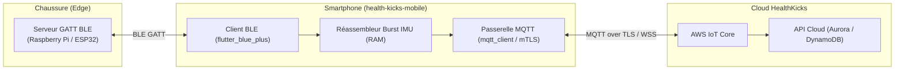

# HealthKicks Mobile (`health-kicks-mobile`)

Application mobile compagnon et passerelle **BLE-to-MQTT** pour l'écosystème de chaussures connectées **HealthKicks**.

Développée avec **Flutter**, l'application sert de pont temps réel entre le serveur GATT BLE de la semelle instrumentée (hébergé sur Raspberry Pi / ESP32-S3) et le Cloud AWS IoT Core.

---

## 1. Rôle & Responsabilités d'Architecture

1. **Passerelle BLE-to-MQTT :**
   - Écoute des alertes d'activité et de détection de chute via notifications BLE (`7a5a0002-...`).
   - Relais immédiat vers AWS IoT Core sur `healthkicks/v1/{device_id}/events/detection`.
   - Réception des commandes haptiques du Cloud (`healthkicks/v1/{device_id}/commands/haptic`) et écriture BLE vers la semelle (`7a5a0003-...`).
2. **Gestionnaire de Sessions Studio & Burst Transfer :**
   - Démarrage et orchestration des captures calibrées (commande `START <label> <duration_sec> <session_id>` sur `7a5a0004-...`).
   - Réception et réassemblage des paquets de trames IMU à haute vitesse (`7a5a0005-...`).
   - Vérification de l'intégrité CRC32 et transmission des données brutes au Cloud (DynamoDB).
3. **Expérience Utilisateur Mobile :**
   - État de connexion BLE de la chaussure en direct (RSSI, niveau de batterie, statut).
   - Déclencheur manuel de stimulation tactile pour tests cliniques.
   - Journal des événements et notifications locales d'urgence.

---

## 2. Dépendances & Stack Technique

- **Framework** : Flutter 3.19+ / Dart 3.3+
- **BLE** : `flutter_blue_plus`
- **MQTT / IoT** : `mqtt_client` (support TLS avec certificats X.509 ou Signature SigV4 AWS)
- **Architecture de Code** : Clean Architecture / Riverpod

---

## 3. Conformité aux Contrats

L'implémentation de la couche BLE doit respecter rigoureusement le contrat d'interface :
[`contracts/ble_gatt_specs.md`](../contracts/ble_gatt_specs.md).
